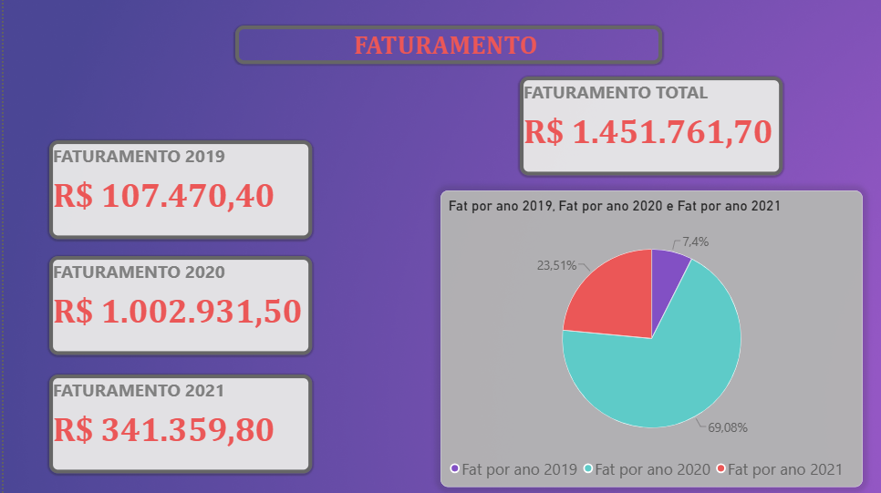
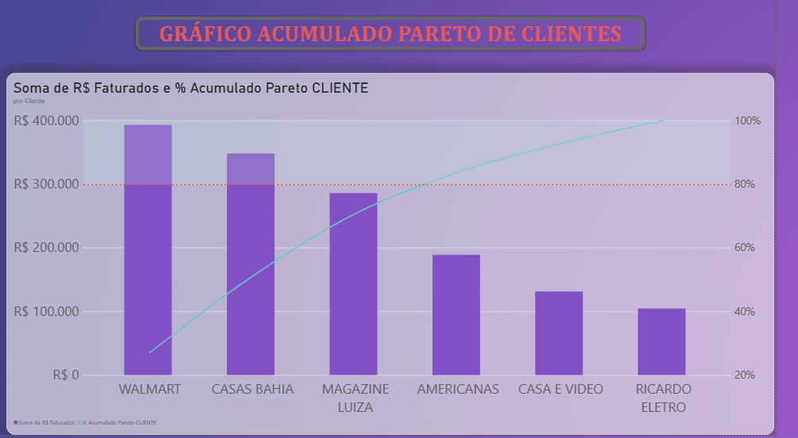
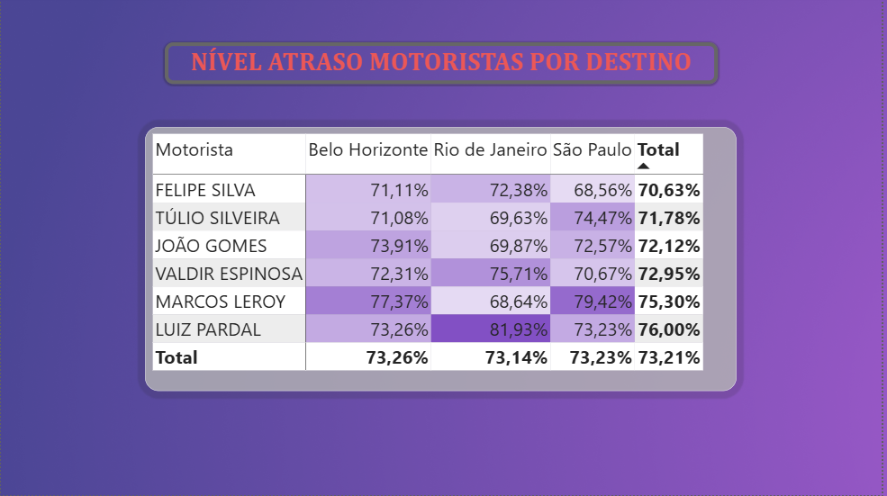
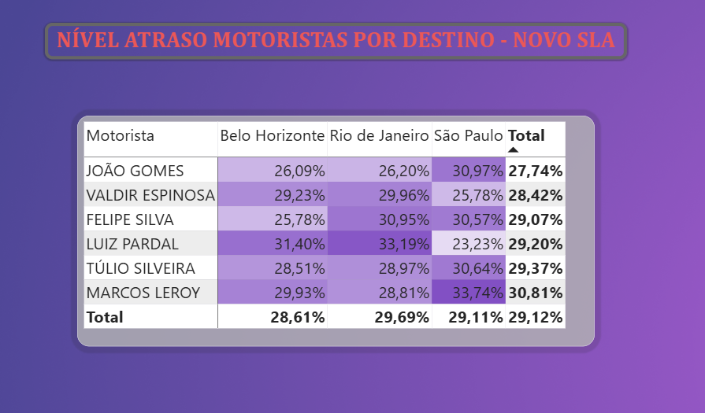

# 📦 BD Logística — Diagnóstico de Dados, Performance e Processos

**Da base bruta ao plano de ação: um diagnóstico completo de operação logística, construído com Power BI, DAX e Excel.**

---

## Sobre o Projeto

Este projeto nasceu de uma base de dados pública, tratada e transformada em um estudo de caso completo de consultoria de dados — como se o autor tivesse sido contratado para diagnosticar e propor soluções para uma operação logística real, a **BD Logística**. O trabalho cobre todo o ciclo: tratamento de dados, modelagem de KPIs em DAX, construção de dashboard em Power BI, diagnóstico de causas raiz e um plano de ação priorizado.

📖 A história completa por trás do projeto — como ele começou e por que foi construído — está no **[Problem Statement](docs/01_Problem_Statement_BD_Logistica.pdf)**.

## O Problema de Negócio

A operação analisada (4.282 pedidos, 2019–2021) apresentava indicadores de nível de serviço criticamente baixos:

- 🔴 **73,21%** dos pedidos entregues fora do prazo prometido
- 🔴 **OTIF de apenas 6,89%** (entrega no prazo, completa e sem avaria)
- 🔴 **75,25%** dos pedidos com pelo menos um item devolvido
- 🔴 **92,58%** das devoluções concentradas em dois motivos: produto errado e produto danificado
- 🔴 Gap de até **13 pontos percentuais** de atraso entre motoristas na mesma rota

## Diagnóstico e Proposta

A investigação revelou **três gargalos concorrentes**, e não uma falha isolada: um SLA comercial estatisticamente inatingível, falhas de conferência no picking/packing do armazém, e desequilíbrio na alocação de frota.

A recalibração do SLA comercial de 10 para 15 dias — sem qualquer investimento — reduz a taxa de atraso para **29,12%** e eleva o OTIF para **17,89%**. Essa ação imediata é complementada por um programa estruturado (metodologia **DMAIC**) de reestruturação do armazém e por um remanejamento de rotas orientado por dado histórico de performance.

📊 Diagnóstico técnico completo: **[Relatório Completo](docs/03_Relatorio_Analise_Logistica_BD.pdf)**
📄 Leitura rápida: **[Resumo Executivo](docs/02_Resumo_Relatorio_Analise_Logistica.pdf)**

## Ferramentas e Competências Demonstradas

| Categoria | Ferramentas / Técnicas |
|---|---|
| **BI e Visualização** | Power BI (modelagem, relacionamentos, dashboards interativos) |
| **Linguagem de Medidas** | DAX (OTIF, OTD, Pareto nativo, medidas de conformidade de SLA) |
| **Tratamento de Dados** | Excel, Power Query (limpeza, transformação, enriquecimento) |
| **Validação Estatística** | Python / pandas (reconciliação independente de todos os KPIs) |
| **Análise de Processos** | Metodologia DMAIC, diagrama de causa raiz, análise de Pareto |
| **Comunicação de Dados** | Storytelling analítico, relatório executivo, plano de ação priorizado |

## Fonte dos Dados e Aviso Legal

Os dados utilizados são de **origem pública** e foram tratados exclusivamente para fins educacionais e de portfólio profissional. Nomes de empresas, clientes e colaboradores mencionados devem ser interpretados apenas como recurso didático-narrativo, sem qualquer vínculo ou afirmação sobre entidades reais.

📋 Termo completo de isenção de responsabilidade: **[Problem Statement — Aviso Legal](docs/01_Problem_Statement_BD_Logistica.pdf)**

## Estrutura do Repositório

| Arquivo | Descrição |
|---|---|
| [`docs/01_Problem_Statement_BD_Logistica.pdf`](docs/01_Problem_Statement_BD_Logistica.pdf) | A história do projeto, o contexto e o aviso legal completo |
| [`docs/02_Resumo_Relatorio_Analise_Logistica.pdf`](docs/02_Resumo_Relatorio_Analise_Logistica.pdf) | Resumo executivo — leitura objetiva em 2 páginas |
| [`docs/03_Relatorio_Analise_Logistica_BD.pdf`](docs/03_Relatorio_Analise_Logistica_BD.pdf) | Relatório técnico completo — diagnóstico, causas raiz e plano de ação |
| [`data/01_BD_Logistica_dadosbrutos.csv`](data/01_BD_Logistica_dadosbrutos.csv) | Base de dados bruta, fonte original pública |
| [`data/02_BD_Logistica_com_kpis_resumida_dados_tratados.csv`](data/02_BD_Logistica_com_kpis_resumida_dados_tratados.csv) | Base intermediária, tratada no Excel, com KPIs calculados para auditoria |
| [`data/03_Dados_PowerBI_BD.csv`](data/03_Dados_PowerBI_BD.csv) | Extrato final, efetivamente consumido pelo modelo do Power BI |
| `dashboard/` | Arquivo `.pbix` do dashboard — *em produção* |
| Vídeo de apresentação | Gravação em áudio e tela do dashboard — *em produção* |

## Principais Achados

- 📈 Faturamento total de **R$ 1.451.761,70** em 4.282 pedidos, com ticket médio de R$ 339,04
- 📦 A calibração de SLA (10 → 15 dias) reduz o atraso de **73,21% para 29,12%**, sem custo
- 🏷️ **92,58%** das devoluções concentradas em "produto errado" e "produto danificado" — falha sistêmica de picking/packing, presente em 75,25% dos pedidos
- 🚚 Gap de até 13 p.p. de atraso entre motoristas na mesma rota — oportunidade de remanejamento sem custo adicional
- 💰 Valor estimado de **R$ 259,5 mil** (17,87% do faturamento) imobilizado em itens devolvidos

## Prévia do Dashboard

| Faturamento | Pareto de Clientes |
|---|---|
|  |  |

| Atraso por Motorista — SLA Original | Atraso por Motorista — SLA Calibrado |
|---|---|
|  |  |

## Vídeo de Apresentação

🎥 *Em produção.* Uma gravação em áudio e tela percorrendo o dashboard interativo no Power BI, com a narrativa dos principais achados, será adicionada aqui em breve.

## Como Explorar Este Projeto

1. Comece pelo **[Problem Statement](docs/01_Problem_Statement_BD_Logistica.pdf)** para entender o contexto e a origem do projeto.
2. Leia o **[Resumo Executivo](docs/02_Resumo_Relatorio_Analise_Logistica.pdf)** para uma visão rápida dos números e recomendações.
3. Aprofunde-se no **[Relatório Completo](docs/03_Relatorio_Analise_Logistica_BD.pdf)** para metodologia, causas raiz e plano de ação detalhado.
4. Explore os arquivos em `data/` para acompanhar o pipeline: dado bruto → tratamento com KPIs → extrato consumido pelo modelo.
5. (Em breve) Abra o `.pbix` em `dashboard/` no Power BI Desktop para navegação interativa, ou assista ao vídeo de apresentação.

## Nota Metodológica — Uso de IA Generativa

Este projeto contou com o auxílio de ferramentas de IA generativa (**Claude, Anthropic**) para apoio na formatação, revisão redacional e validação cruzada estatística dos indicadores apresentados nos documentos. A concepção analítica, o tratamento de dados, a construção das medidas DAX, o dashboard em Power BI e o diagnóstico de causas raiz são de autoria do próprio autor.

## Contato

**Daniel V. Martini**
📧 [seu e-mail aqui] · 💼 [seu LinkedIn aqui]

---

*Este é um projeto de portfólio pessoal. Os dados utilizados são públicos; veja o [aviso legal completo](docs/01_Problem_Statement_BD_Logistica.pdf) para mais detalhes.*
